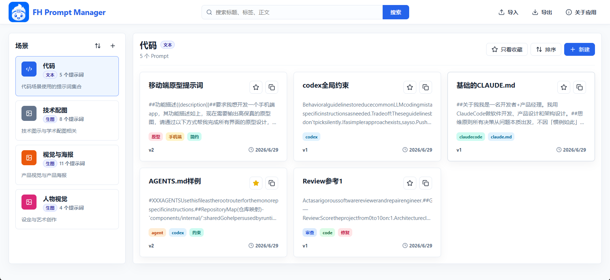
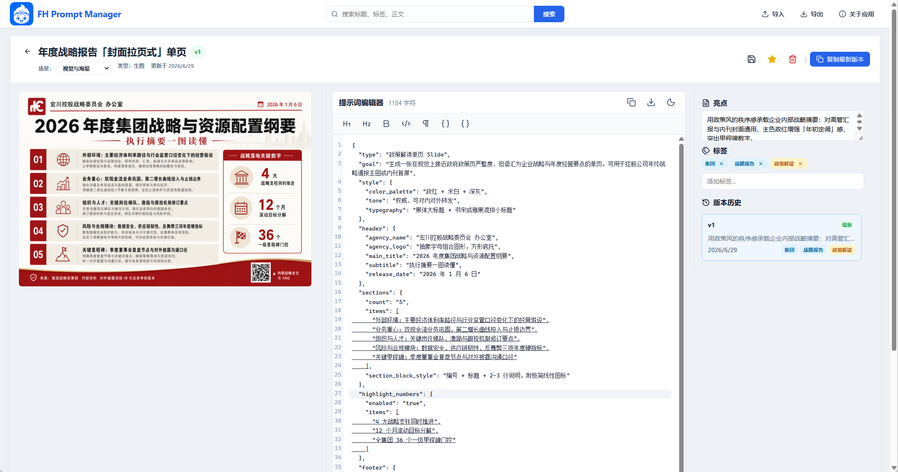
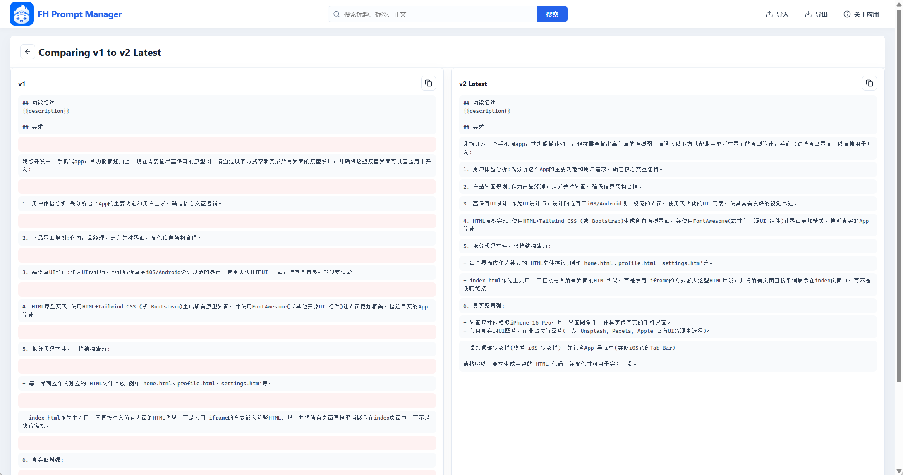
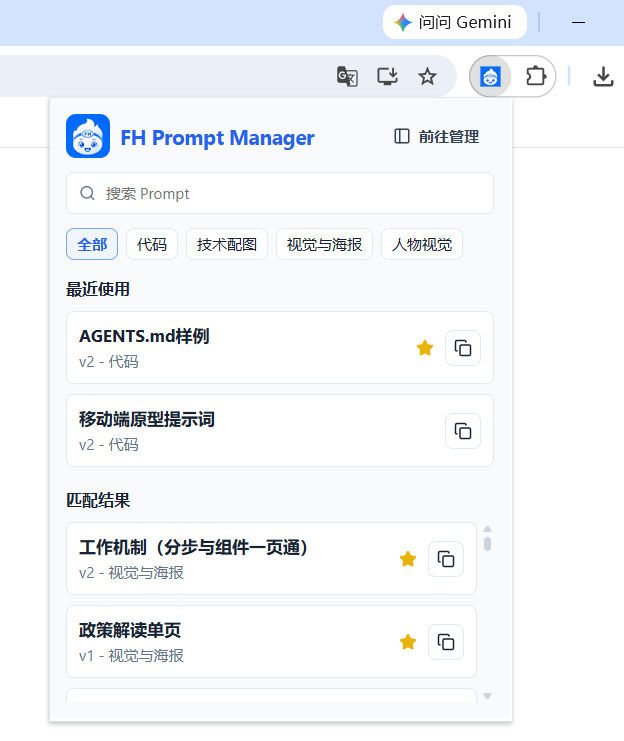

# FH Prompt Manager

> A frontend-only, local-first prompt manager for Chrome and Edge.

[中文文档](README.md)

FH Prompt Manager is a lightweight browser extension for collecting, organizing, versioning, and quickly reusing prompts. It is built for people who use AI tools every day and want their prompt assets to stay searchable, structured, and private on their own device.


## Preview

> 

> 
>
> 

> 

## Why

Prompts are becoming reusable work assets, but they are often scattered across chat histories, notes, documents, and screenshots. FH Prompt Manager gives them a dedicated home:

- Keep useful prompts organized by scene.
- Reuse prompts from a small browser popup without opening a full workspace.
- Track versions as prompts evolve.
- Save text prompts and image-generation prompts together with their result images.
- Export and import your library as a local backup.

No account, no server, no remote storage.

## Features

- Scene-based prompt library for different workflows.
- Text prompts and image-generation prompts.
- Fast popup search and one-click copy.
- Favorites, tags, highlights, and recent-use tracking.
- Version history for every prompt.
- Side-by-side version diff.
- Local image asset storage for image prompts.
- ZIP import and export for complete local backups.
- Offline-first data storage in browser IndexedDB.
- Minimal extension permissions.

## Install

FH Prompt Manager is distributed to users as a packaged `dist` zip file. You do not need Node.js or `npm` to install it.

[Download the latest release package](../../releases/latest), then download `fh-prompt-manager-*.zip` from Release Assets.

After downloading:

1. Unzip `fh-prompt-manager-*.zip`.
2. Open the Chrome or Edge extensions page.
3. Enable Developer mode.
4. Click "Load unpacked".
5. Select the unzipped `dist/` directory.

If you want to build from source, see the Development section below.

## Development

If you want to run the project from source or contribute to development, install Node.js first and then run:

```powershell
npm install
npm run dev
npm test
npm run lint:types
npm run build
```

The extension has two browser entries:

- `manager.html` for the full prompt library.
- `popup.html` for fast search and copy.

To publish a new version, run `npm run build`, compress the generated `dist/` directory as `fh-prompt-manager-vX.Y.Z.zip`, and upload it to the GitHub Release Assets.

## Data And Privacy

FH Prompt Manager stores data locally in your browser through IndexedDB. Prompt content, tags, versions, usage records, and image assets stay on your device unless you manually export them.

The extension does not require an account, does not use a backend service, and currently requests no browser permissions.

## Roadmap

- Public release packaging.
- More polished screenshot and demo assets.
- Better import/export guidance.
- Optional restore or duplicate flows for historical versions.
- More prompt organization and discovery improvements.

## Contributing

Issues, ideas, and pull requests are welcome. Before opening a larger change, please describe the problem first so the scope can stay focused.

This project is intentionally local-first. Changes that introduce remote storage, broad browser permissions, or server dependencies should include a clear reason and privacy impact.

## License

This project is open-sourced under the [MIT License](LICENSE).
